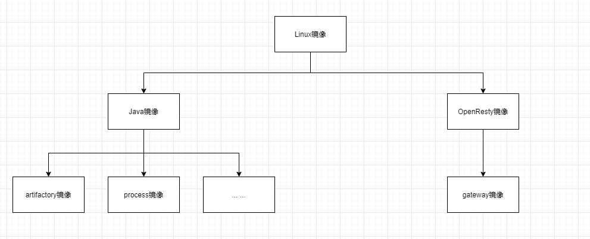

## 分层图

## 概述
打包的镜像分为三层: 系统层、基础服务层、业务服务层 , 将镜像进行分层处理有两个好处:
- 尽量将变动少的镜像置于底层, 将变动大的镜像置于顶层
- 抽象镜像的依赖 , 将可以复用的部分抽离出来 , 降低镜像的维护成本

## 系统层
以普通Linux为基础,将相关工具(如ping,iostat等)打包到镜像中,供基础服务和业务服务使用

## 基础服务层
在系统层上面进行构建, 将业务服务需要依赖到的基础设施打包进来, 给业务提供可运行环境

## 业务服务层
将业务代码和基础服务打包到一起, 每次代码变更只要重新打包该层即可, 是最终运行在k8s上面的镜像